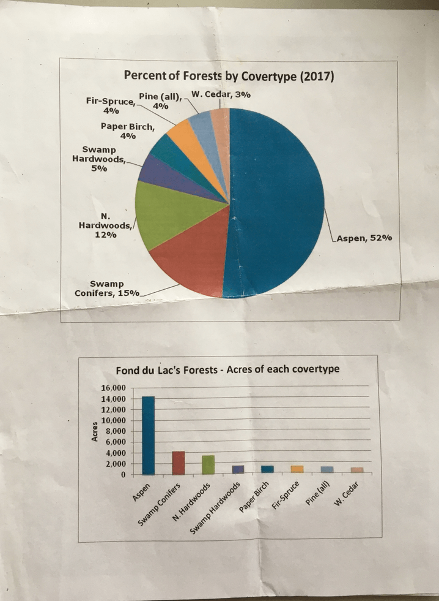

# Day 1 - The Northeastern Forest

*May 28, 2019 
Christian Nelson, Forester 

##Fon du Lac Reservation, eastern shore of Dead Fish Lake  
MHN 44 Mesic Hardwood Site
www.fdlrez.com

* Geographical awareness:  we are near Cloquet near the boundary of Superior Lobe till and outwash parent material

* Christian has been with FDL Reservation for more than 14 years.  He grew up in the Twin Cities and didn’t know much about tribes until he took this job.  He values many things about his job, in particular the spirit of cooperation and strong land ethic that the tribe has

* We are on the shore of Dead Fish Lake. The Ojibwe term for this lake translates to “the place where the little Canadian woman lives” 

* “Dead Fish” refers to the fact that the lake fish kills in the winter (shallow) 

###Intro to FDL 
* “Fon du Lac” is a French term - “head of lake”  
* The Ojibwe term for the reservation is “Nagaajiwanaang” which means “where the flowing water stops”
* St Louis River forms the N and E boundaries of the reservation 
* Important travel route - intersection of St. Louis River and Lake Superior 
* FDL people probably lived closer to Duluth when first arrived in this area. 
* FDL is 1 of 7 Ojibwe bands in MN. There are 11 in WI.  Many more bands in Canada
* Current population of FDL band members is ~4,000 people.  Approx half live here on the reservation, and half elsewhere.  
* Total native population in MN is ~57,000
* US population of Ojibwe people is approx 170,000, similar population in Canada
700-800 years ago, FDL people were mostly living in New England states.  The Dakota lived in this area of MN at that time
* FDL people had a prophecy that they had to move west to where “the food grows upon the water”.  In their migration story, there were 7 fires or 7 stops along the way.  The final stop would have been Spirit Island in the St. Louis River Estuary.  FDL recently acquired Spirit Island   
* Approximately 400 years ago, the FDL people arrived in this area
* In 1854, the La Pointe (sp?) Treaty established the FDL reservation and other reservations in MN.  Estimated 100,000 acre reservation boundary on the map [at time of treaty signing or present?]
* When treaty signed, non-native population in this area was ~6,000.  Just 50 years later the non-native population was 1.7 million!  Huge European migration strained resources and changed politics
* 1854 - ceded territories established (see wood panel on sheet that Christian gave us) Ceded territories each represent a different treaty.  FDL is a signatory to 3 of the ceded territories. 
* FDL people have retained hunting, fishing, gathering rights on many [30 or 3 million??] acres.  Christian emphasizes retained because the Native population always had these rights.  US did not give the Native people these rights.  Hunting, fishing, and gathering are very important to the Native population to maintain their sovereignty and lifestyles.  
* Christian notes that it is an ongoing struggle for the bands to hold onto those treaty rights - cites band involvement in Polymet and Twin Metals Mines debates.  Also notes that the goals of the bands and environmentalists are very similar - the bands do not want resources exploited.  

###Land Ownership 
* Christian shows map of reservation - why does map show so much non-FDL ownership within the Reservation boundaries? 
* Dawes Allotment Act in 1867 (? check date/sp): Timber and mining interests wanted access to resources on the reservation.  
* Goals of the Act: 
    + Free up land for timber and mining interests, followed by European settlers
    + “Civilize” Native people by introducing concept of private land ownership, farming
* FDL head of house entitled to 120 acres
* Others entitled to 80 acres 
* Remaining open for settlement, mining/timber
* In total, half to two thirds of treaty lands were opened up to settlement in the Dawes Allotment Act.  
* Christian notes that the Twin Cities and Chicago are built on timber that came off native lands.  
* Rivers were important transport mechanisms for moving timber. White Pine in particular has the unique property of floating in water.  
* On the maps Christian gave us, orange = County land 
* When people [settlers]  tried to farm this land, found it unfavorable.  They basically attempted to drain wetlands and plant potatoes and corn.  Christian notes that many of these early European settlers were uneducated, impoverished people with little knowledge of farming.  Essentially peasants without other options.  When farming attempts failed on the land, the properties went tax forfeit and the County took ownership
* In the last 14 years, FDL has purchased 6,000 of these “orange” (County) acres as they have come up for sale.  * FDL is buying County and private land whenever possible. 
* Christian notes Potlatch (company?) has sold off lots of assets in MN.  
* State land - more tax forfeit
* White color on map - private property 
* Green colors - multiple types of ownership by tribe
    + Allotment
    + Band/Trust:  Owned by band, not individuals) 
    + Fee Land:  Band pays taxes on the land 
* Christian emphasizes that different types of ownership have implications on management.  Allotment is the most onerous to manage - hard to set up timber sales, etc. 

 

###Resource Management Program 
* FDL has a well-developed Resource Management Program, one of the best developed, multi-faceted programs
    + Air Program
    + Energy Program (solar, biomass boiler heating (for community center?), wood waste (?) 
    + Fisheries - example of successful sturgeon stocking into St. Louis River Estuary
    + Natural Resources
    + Water/Wetlands/Groundwater Program 
* RM Program has 7-8 staff now, 10 when fully staffed 
* Community service 
* RM Program helps out after wind storms, bad snow storms. Help people cut tress out of driveways, yards.  Clean up * Emergency management for floods 

###Wild Rice 
* Dead Fish Lake (where we are standing) is 1 of 5 important wild rice lakes on the Reservation.  The lake is ~60 acres in area 
* Christian notes that in a month and a half, this lake will look like a hayfield! 
* Wild Rice = Izania palustris.  Is an annual plant related to grass.  Ripens in falls and some falls into lake and overwinters.  It germinates in the cool mucky bottom of the lake.  
* In spring when it is growing, Christian notes the important “floating leaf stage”.  Not yet strong enough to stand up on its own, very sensitive to fluctuating water level.  This is why it’s important to have some water control structures (dam/impoundment)
* We saw the deep, linear drainage ditches on our drive in - these were put in between 1909-1915.  
* 1909 was date of “Judicial Ditching Law”, which allowed any homesteader to petition to have their land drained for free to promote farming.  Sometimes, they would do a whole township at a time.  The result was a whole network of ditches dug to drain bogs, wetlands and swamps
* The ditching drastically changed the hydrology in northern MN. 
    + Before:  Natural stream beds that evolved after the glaciers retreated had shallow banks, overflowed regularly to deposit rich soil in the surrounding floodplain.  After big storms water was slowed, ponded, stored in the landscape
    + After: Drainage ditches and channels can’t overflow their banks to renew the floodplain.  Lost the floodplain effect, groundwater recharge opportunities too.  After big storms water moves very quickly out to Lake Superior. Huge disruption to wild rice in the floating leaf stage! 
* 2012 - extreme flood, disaster for wild rice.  
* Harvesting wild rice
    + Rice gets 6-8 ft tall.  The ricer (harvester) uses knockers/flails made from cedar to bend rice and knock it down into the bottom of the boat.  
    + While the harvester works, another person (the poler) uses a ricing pole with a wider base to push into the loose mucky soil 
    + Poler stands in the back of the boat, ricer in the front
Late season hail or winds can prevent fall harvesting.  More frequent summer storms threaten harvesting, can degrade rice habitat
   + Good rice harvesters can fill a boat with 350 lbs of rice in 5-6 hours
* Group observes trumpeter swans on the lake - they are a success story in some ways.  Trumpeter swans were once on the endangered species list.  Now their population is ~18,000.  However, they also eat LOTS of wild rice - seeing this especially at FDL in the last 3 years.  The swans can create big holes in the rice lakes 

###Soil Investigations -- near Dead Fish Lake -- MHN 44 (Mesic Hardwood North)
* Group observes mound from tree throw in the woods 

* Don’t have many spodosols here in MN - we are a little too dry.  You can find good spodosols in Michigan (UP), N WI.  

**GUTTER 1 - upland near road - Omega Series**

* Textures are loamy fine sand over sandy clay loam 

* Thin E horizon, spodic Bs/Bhs 

* Redox at less than 1m indicates local perching effect 

* Mixed influence from Superior outwash and Superior till deposited on top of one another

We are standing near a small ridge - can see on LIDAR.  Christian’s theory is that the water level in the lake to the west of us (Dead Fish Lake)  was once higher.  Every few years ice in the spring would get pushed [by the wind] over the course of hours and days, scraping up the shoreline and mounding it here (ice ridges).  This is why we see a narrow ridge with a different soil type along the road.  There are a few other lakes in this area where you see  a similar pattern - they have long, open west exposures and a similar pattern of ice ridges.  Typically loamy fine sands are associated with eolian sands - but this is not the case here.  

**GUTTER 2 - lowest position in woods - Aquept (doesn’t quite make spodosol)**
O  
A  
E  
Bs  

What was the vegetation like here pre-settlement?

* 1918 Cloquet Fire + ditching + logging created huge disturbances in the ecosystem.  This area was historically wetter. 

* The vegetation we see today is earlier successional compared to what would have been here pre-settlement. 

* Lost lots of forested wetland (spruce swamps and tamarack bogs) due to ditching.  White pine has been replaced with earlier successional aspen 

* Previously would have expected a greater coniferous component.  Historical coniferous vegetation fits with the soils we see here.  

* Spodosols require albic E horizons, 4/2 and into upper left corner of color page.  Horizon below has to be 4/4 or darker. 

###Blueberries 
* We passed the retired forester in his car on the way in - he was here to check out the blueberry patch that they have been burning for the last 5-7 years.  

Historically, the blueberries were maintained by fire from lightning or purposeful fire that the Native Americans lit.  Native Americans have a long history of burning for management, using fire as a tool to open up areas.  
Want to burn blueberries in the spring when they are dormant is soil is a little wetter.  Commercial blueberry growers cut the plants back every 2-3 years to keep plants vigorous.  

When Christian and other resource mgmt staff burn this area, they make fire breaks by the road and in the woods. Use drip torches and try to work with a wind from the east to push fire toward the lake. 
Blueberries are primarily pollinated by black flies 

According to one member of the Grand Portage Band, it was traditional to burn blueberry plants after picking - possibly a fire of convenience?  

* Types of prescribed burns 

   + Habitat management - burn shorelines 
   + Food burning - blueberries
   + Fuel reduction burn - burn fuel to reduce intensity of future wildfires
  
Burning shorelines maintains these areas in early successional vegetation.  Although these areas have fewer species, they have more rare species (according to the Lake State Fire Consortium) 

FDL does prescribed burning AND wildfire suppression - this means they are very busy!  Need to carefully management resources and labor.  Have dual goals and responsibilities 

##2nd Stop - Ditchbank Road & woods nearby   [WFN 55 Black Ash Stand]
We are observing the drainage diches.  In 1909 they used steam shovels to dig “Ditchbank [Forest??] which is where we are now. 

In 2012 this whole area was completely underwater during some very bad flooding.  Could only get in by air boat. The birches survived the flood better than the aspens.  

**Emerald Ash Borer**
Found in MI in 1999 and spreading.  In 2013 found in Park Point WI.  Adult beetles can fly up to 12 miles
MN has more ash trees (~1 billion)  than any other state in the nation (MI held this title before the Emerald Ash Borer came…) 

Now we are gathered in a black ash stand.  There are ~2 square miles of black ash stands in FDL.  Black ash is unique, only species that seems to tolerate these sites with really wet periods, high water table, but in the summer can get drought and dry out.  

Emerald Ash Borer could create 1 million UNFORESTED wetlands if we lose black ash trees.  This is because the black ash moderate the water table through transpiration.  When transpiration stops, water table goes up.  This might create an environment that is too wet for other tree species.  Christian calls this the “bathtub theory.”  The trees are little straws that keep the bathtub half full.

With extreme rain events, have lost ability for water to settle, infiltrate.  Water runs off.  If we lose ash stands in the headwaters and tailwaters of wild rice areas, you get more surface runoff from summer storms and more frequent disruptions for the wild rice

In the Chippewa National Forest they are experimenting with 13 non-ash species in these ash stands.  Trying to see if any survive and could replace the hydrological function of black ash.  Christian is doing a similar experiment in FDL too.

Shannon Kessner - wetland specialist   

* We are standing in 1 of the 6 experimental sites here.  Each site has 200 trees, 5 different species.  
    + Silver Maple 
    + River Birch** this species is doing the best so far, is native to SE MN
    + Red Maple 
    + Northern White Cedar
    + Balsam Poplar
    
* Biggest challenges with this tree experiment are deer and hare browse. 

* By Dead Fish Lake, have tried planting swamp white oak and burr oak.  

* Jeff explains MN DNR’s Ecological Classification scheme - uses native plant communities to indicate ecological conditions   Format is:  XXX ## e.g. WFN 55
    + First number: moisture scale 1-9  (low to high)
    + Second number: nutrients Scale 1-9 (low to high) 
    
* Knowing the classification of a site informs us about what other species might do well here 

* We are in a WFN 55.  WFN 64 would also be a black ash stand, but wetter

* Indicator species, both canopy and sub-canopy, and also soils are used to determine the native plant community classification. 

* NRI - UMN Duluth.  George Host and others have looked into taking soil maps and native plant communities and figuring out how we cross-walk between them.  Need to consider other site factors such as water table. 

Nic/Jeff idea:  this could be an opportunity for machine learning - cross-walking native plant communities and soils.  Combine soil series, LIDAR, and plant communities maps.  Possibliity for a LCCMR study?  
These experiments are so important because time is limited - trying everything they can in the time they have.  There are consequences beyond losing this unique habitat. 

* Black ash is a unique cultural species - to the Ojibwe it is known as “auga-makk” [sp?], which translates to “snowshoe making trees” 
* Black ash is a ring porous species.  If you cut it down and pound on it, the tree will split at the annual growth rings.  Get thin pieces of wood that can be used for making baskets and snowshoes. 
* Culture, land, and resources are all intertwined.  Can’t have one without the other. Losing black ash is a death to parts of the Ojibwe culture.
* Christian’s idea - cut down some black ash, bury deep in Lake Superior, fish them out later for ceremonial purposes.  One way to preserve these precious trees in the anoxic conditions deep in the lake.    

**Von Poss Scale - way to estimate organic decomposition**
1-3: Fibric, holds lots of free water, when you squeeze clear water comes out 
4-7: Hemic
7+: Sapric, when you squeeze little or no water comes out (organic material might squish between your fingers) 

* Possible that worms we saw earlier [in the forest] were transported on steam shovels.  Nic’s guess is that the organic layers we are seeing here are much thinner than they used to be historically 
Interpretation of landscape: 

* We are on a lakebed here.  The lacustrine sediment here tnds not be as clayey. More sandy, fine sand from short term lakes
* Uplands here are Superior Lobe Till
* Flat landscapes are outwash plains or lake beds 

###Soil Investigations-- Ditchbank Road & woods nearby   [WFN 55 Black Ash Stand]

**GUTTER  1**
Oa (sapric) less than 10cm  
Bw  
Cg - very fine sandy loam  

Soil map unit here same as by Dead Fish Lake, but we have different vegetation

**GUTTER 2** 

* In the uplands here you see glacial till, erratics, coarse fragments.  In this gutter we have a more upland soil.  5YR / 7.5YR sandy loam with coarse fragments.  Spodosols are developing on sandy areas with good infiltration & pine trees

* In this are we see local loess deposition.  Geologists have only mapped this when it is >1m thick, but Nic has made a map of thin loess in N MN for soil series w/ thin loess/silt caps on the Eastern side of lakes 

Review:  so far we have seen three soil orders:  an upland alfisol, inceptisol, and a spodosol 

##Third Stop - Hardwood Thinning Project  -- MHN 35 or 47
* Species we see here:  sugar maple, basswood, yellow birch  
* “Asbestos forest” ?? 
* We are in a hardwood thinning project on land acquired from Pot Latch 15 years ago.  This area was cut ~20 years ago.  
* Historically probably had richer component of hardwoods.  Northern hardwoods are wind driven in terms of disturbance (not fire) 
* Should see a rich layer of sugar maple seedlings if this area isn’t too impacted by earthworms. Chrisitan guesses there are lots of earthworms here because: 
* Lack of maple seedlings
* Less diverse understory plants (lots of Pennsylvania Brome Grass) 
* Northern hardwood systems often clearcut in the 1800s-1900s. Clearcutting has a huge impact on the system, letting in lots of sunlight all at once.  Burns up the maple seedlings and allows sun-loving species like aspens to grow.  
* Management at this site - trying to actively manage to get back to the piecey, patchwork canopy as it was historically  (caused by windthrow).  EQIP offsets the cost of labor out here 
* Species composition
    + When site purchased:  80% aspen/birch and 20% hardwood 
   + Now:  50% aspen/birch and 50% hardwood
   + 40 years in future: 30% aspen/birch and 70% hardwood 
* Can remove more aspen and birch in a commercial timber sale 40 years from now, which will help adjust the species composition and allow them to keep the shade loving trees
* Many other agencies don’t invest the same resources in resotring these unique ecological and cultural communities.  FDL looking beyond economics. Ultimately htis is about landowner objectives 
* Christian speaks about professional ethics - there is a professional obligation to let his employer know what is on the table  in terms of ecological & environmental consequences 

**GUTTER - Hardwood Thinning Project**
Textures - medium sands - more outwash.  This is an inceptisol.  Don’t see an O layer here because of the earthworms.

A : over-thickened, past disturbance, presence of earthworms  
E  
Bw  
C  

We are on a boundary here between map units.  One unit is till, one is outwash. 

###Earthworms
* Sugar maple seedlings are sensitive to drying out.  Ideally you want a nie thick layer of duff to help them stay cool and moist.  Once earthworms are at a site, this duff layer disappears.  The earthworms also increase compaction and change the nutrient cycling 

* Worms actually prefer sugar maple leaves because they are rich in Ca.  The worms can use Ca in reaction to breathe underwater.

* If we were in a non-earthworm site, the ground would feel much more spongy under our feet in a northern hardwood site 

* “Root gingivitis” :  When earthworms move in, they eat the duff layer and expose roots aboveground. The trees start to show drought stress when they have to grow new find roots into the mineral soil 

###Christian’s Career Story 
* Undergrad major was wildlife 
* Did forestry work through an internship.  That internship is why he is here today! 
* Went back to school for forestry 
*Worked short-term jobs for a while, bounced around 
* What Christian looks for when he is hiring: 
   
    + Make yourself in expert (in something) 
    
    + Hit the ground running 
