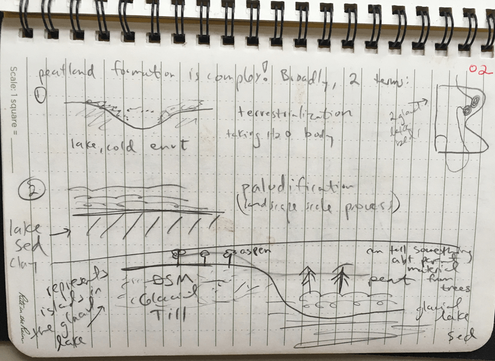
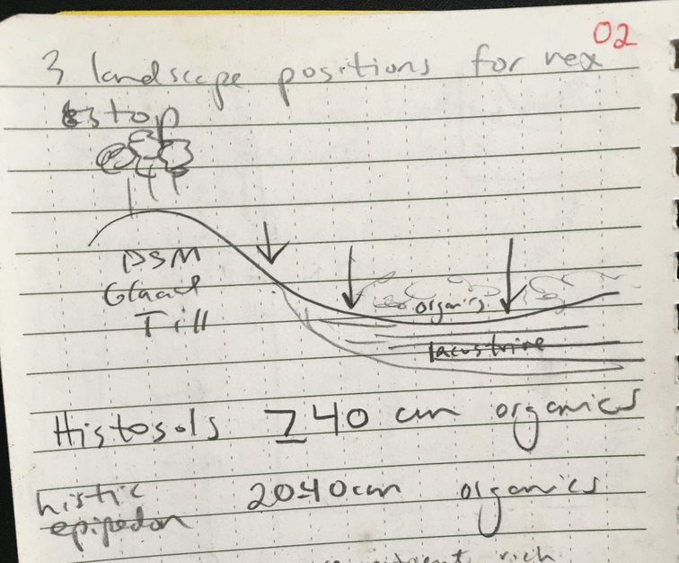
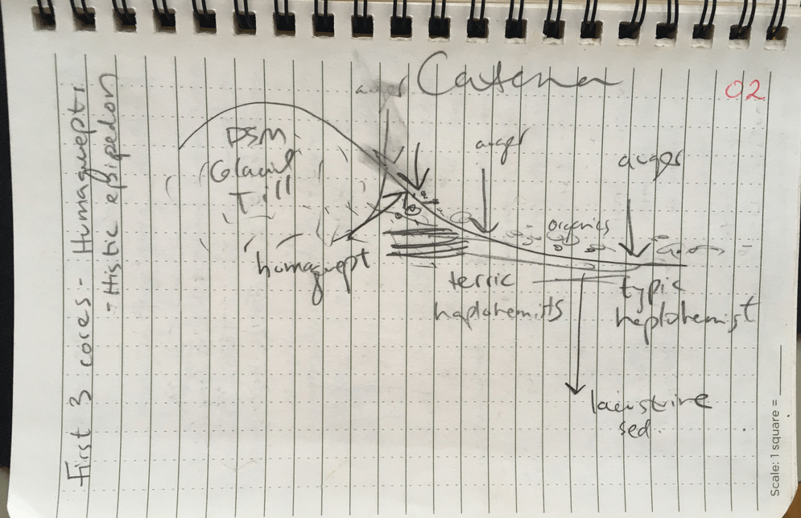

# Day 2: The Northeastern Peatlands: Bog Day!

**May 29, 2019**

##Northwoods Organics

*"The Moss is Boss"* 

Roy & Vic

###Peat harvesting 

* Go through with harrow to spike/fluff the peat. 
* Use spoons (“hockeys”) to pile into windrows. Peat has to be dry when you pile it, or you can start a fire! 
* Have lost lots of peat to fires in the piles within the last year.  >2,500 yds^3 lost last year due to fire.  Took >80,000 gallons of water and 5 fire depts to put out the fire
* Peat harvester is like a vacuum cleaner.  Giant fan creates suction to suck peat up into a 20 yd^3 bin  They harvest less than 1 inch at a time after it has been harrowed to fluff it 
* Harvesting is weather dependent, much like cutting hay. Has been too wet recently, haven’t been able to get in the field.  Typically they would have 4,000-5,000 yds^3 by now 
* Have a couple types of harvesters.  The smaller ones they can pull behind a tractor.  Bigger one stands alone.  
* When it’s dry they need to be careful about fire when dust is thrown up near motor on harvester, can start a fire this way too. 
* Sometimes they get complaints from neighbors about dust generated during bagging and harvesting.  New home built 0.25 miles from their main field 
* Workflow - if the weather is nice, working in the field.  Peat can sit piled for months before they bag it.  In winter they bag and do maintenance 
* Important to regularly take temperature of the piles. 125F is the max temp they allow a pile to reach before breaking it open to avoid fires.  Must break open piles slowly, otherwise a fire could start very quickly with the rapid influx of oxygen
* Can typically smell a fire before you see it.  They carry water and spray bottles on the back of equipment at all times so they can deal with fires or smoldering areas immediately.
* Vic & Roy want to get a heat gun so they don’t have to climb piles to take the temperature! We visited a 300 acre field that was being actively harvested (starting in the late 1980s).  Still have 150 acres to open up in this area.  On Highway 7 they have leased land with 2,000 acres that have not yet been opened up for harvesting.

###Peat Bagging
* Texture of peat and moisture level make a big difference when trying to bag - important to keep bags consistent
* Northwoods Organics sells bags in 2.2, 3.8, and 3.0 cubic feet.  They will produce 32,000 bags this year
* Sell just peat, they don’t mix any products like potting soil on site
* Tractor Supply and Blaine are big customers that buy the product.  
* Can get very dusty in bagging facility, takes ~2 weeks to get used to how dusty it is even with masks on.  Need to be careful about fires in the plant too
* Workers here start at $11/hour (they are hiring!) 
* Baling machine can be dangerous if workers aren’t careful - there have been injuries
* Baling process: 
    + Raw peat goes in hopper bed.  Big sticks fall through screen and are kicked outside 
    + Small sticks kicked out by rubber stars and slots 
    + Peat goes through pin auger (?), big chunks to hammer mill to process it finer. 

###Challenges
* Labor is limited
* Weather can prevent harvesting or bagging.  They were shut down for 2.5 months in the winter because it was too cold to bag. 
* Sometimes maintenance / repairs of the baling machine cause temporary shutdowns 
* Sometimes truckers are late to pick up an order, need to wait before their order can be loaded

###Mercury
* Need to test outlet waters and ponds once a month for Hg if there is any water flowing through the gates/rain notches. 
* Roy wants to know how much Hg in the peat - how much do they come into contact with at work?  Nic to send Roy elemental analysis.  
* Most of the S in the soil is in the organic portion 
* Hg and S form functional groups that are closely tied together.  When Hg is deposited on soil, it is quickly bound to S in organic matter 
* There are both anthropogenic and naturally occuring forms of Hg
* Hg & S leach naturally from peatlands, but the process of harvesting releases much more.  When tree cover is removed, temperature of the peat increases, which increases Hg and S cycling.  Even in a natural peatland you would see this pattern of increased cycling with increased temperature. 

**Peat Field - Map Units** 
3 map units out here. 1 fibrist and 2 hemists.  We observed more fibric peat in the newly opened field.  

##Stop at Bog near Northwoods Organics
APN 90 = forested bog 
APN 81 = poor confier swamp

* True bogs get water from precipitation only, no groundwater to contribute richer conditions in terms of minerals, etc. 
* True bog species: leatherleaf, bog rosemary, cranberries 
* Fen wire sedge present here (indicative of somewhat richer conditions) 
* Tamaracks occur in richer conditions, but can also occur in poorer conditions 
* pH less than 4.2 = bog ; pH>4.2 = not bog
* Can sometimes see layers of charcoal in bog cores from when it burned 
* Class learns how to use the Macaulay Auger, classifies haplohemist
* USDA method for determining rub fiber (Nic has opinions about this method) 
    + Form ball 
    + Crack ball open 
    + Rub 3 times between thumb and forefinger 
    + Estimate % fibers remaining 

Terric histosols - when you hit mineral within  1m qualifies as terric

**Peatland formation is complex!  Broadly, two terms to know:** 

**Terrestrialization** - peatland forms in a water body such as a lake in a cold environment

**Paludification** - landscape scale process, peatland forms on top of lake sediment (clay)
Tree species can tell us something about parent material in this area: 
Aspens growing on Des Moines Lobe Glacial till, which would have been islands in the glacial lake 
Black spruce, tamarack, peat growing over heavy clay glacial lake sediment 

##Stop at Sungrow

Reminders:

* Histosols have greater than or equal to 40 cm organics 
* Histic epipedo has 20-40cm organics 
* White cedar - more nutrient rich environment 
* Black spruce - more nutrient poor environment 
* Sungrow is no longer operating.  Were once a small operation, ~4 full time employees
* Looking at drainage ditches (Morgan gets in).  Water flows from the exterior ditches around the peat fields, out of the operation, to this ditch near the road.  Site managers must record water level and take samples per their Mines permit.  Typically see an increase of Hg export with peat harvesting
* Settling ponds collect water from the external field ditches. Allows fine particulates to settle, slows water.  * The natural hydrology is a state of stagnant GW - we have “re-plumbed” the landscape here.  
Sungrow used to sell to Lowes and Home Depot.  Mixed potting soil on site. 

**Catena at Sungrow (see previous illustration)**

* Catena starts with mineral island and moves lower 

* Near road/mineral: Endoaquept 

* Midway into woods: Terric haplohemist 

* Closest to peat: Terric haplohemist

* Seeing spectacular blue/grey colors here!  Gley 1 page
    + 4/5G
    + 5/5BG
* One group found marl in their profile 

* Oxidized root channels visible 

* With stagnant groundwater, lots of Fe reduction 

* Why are we more likely to find blue/green soil in this landscape compared to Southern MN? This environment provides the three important things you need to get really blue/green soil:

      1. anaerobic conditions-stagnant GW
      2. carbon food source (peat) 
      3. microorganisms (anaerobes)

GUTTER - Sungrow Humaquept

Oe:  0-24cm histic epidpidon  
A:  24-36cm highly organic silt loam  
Bw:  36-60cm  
Cg1:  60-70cm  lacustrine parent material  
Cg2:  70-120cm  
Cg3:  120+ cm  marl in this horizon  

* Plants here - sphagnum, aulacomium, black spruce.  Black spruce is on the southern end of its range here.  As you move north it becomes more dominant 

 

