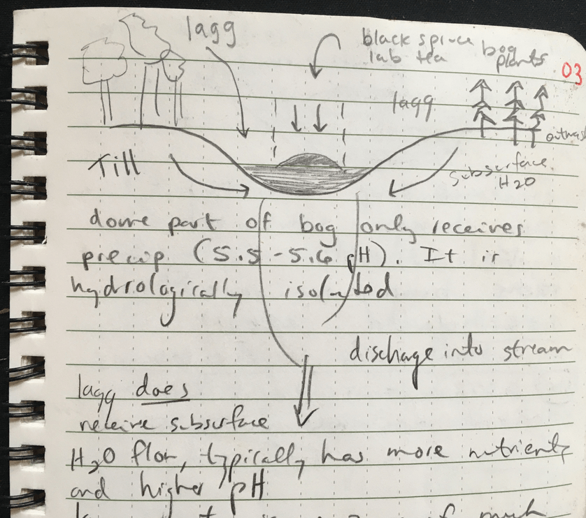

# Day 3: The North Central Forests

Day 3 - May 30, 2019

##SPRUCE / Marcell Experimental Forest 
Dr. Randy Kolka 

###“Marcell Experimental Forest and the Spruce and Peatland Responses Under Changing Environments (SPRUCE) Experiment (+ Peatlands + Mercury)""

*  Randy was a reviewer and author on IPCC report, is the foremost researcher on peatlands 
*  Randy works for a small arm of R & D at US Forest Service
*  There are 83 experimental forests across the US.  
*  ~70 are focused on growing trees (silviculture)
*  ~12 watershed based forests 
*  Marcell was established in 1960 with experimental peatlands in each watershed. 
*  They have a paired watershed approach - reference watershed and treatment watershed are paired to understand the impact of different treatments 
*  “Responses under changing environments” : What is changing? 
    +  The growing season here is 21 days longer now compared to the 1960s
    +  You see most of the warming manifest in the “shoulder seasons”  (spring and fall), especially changes in low temps (lows not as low) 

###Biogeochemical Cycling Research @ Marcell 
1st NADP site in 1977 to study acid rain 
Peatland hydrology & soils 
Forest management effects on water quality and quantity 
Mercury 
Climate change / carbon 
From all the research that has been conducted here, Marcell has many long-term databases going back to the 1960s - 1970s.  

###Peatlands
Peatlands formation: 

* Terrestrialization (of an ice block depression) happens when depression is disconnected from water table.  When the depressions stays connected to the water table, you get a lake like the one right outside the window.  

* GW level is the key factor determining why some lakes become peatlands and some don’t.  

* Paludification - when a limiting layer causes water to accumulate, peatland can form 
* The peat at the south corner of Marcell is 11m deep!! 

**Peatland Functions**

Peatlands make up 3% of the terrestrial area, but store 30% of soil carbon.  However, this might be starting to change 
In the recent years when they have had a warm fall, see the experimental peatlands become a C source.  Plants senesce when they have finished their life cycle, but the microbes don’t!  Continue producing CO2
Peatlands are important habitats for critters and endangered plants!

+------------------+------------------+
| Bogs             | Fens             | 
+==================+==================+
| pH 3.5-4         | Higher pH        |
|                  |                  | 
+------------------+------------------+
| Low nutrients    | Higher nutrients | 
|                  |                  | 
+------------------+------------------+
| Higher DOC       | Lower DOC        |
|                  |                  | 
+------------------+------------------+
| Lower outflow    | Higher outflow   | 
|                  |                  | 
+------------------+------------------+
| Small, numerous, | Bigger, fewer    |
| domed            |                  | 
+------------------+------------------+
| Formed by        | Paludification   |
|terrestrialization|                  |
|lagg important    |                  |
|sensitive to      |                  |  
|precip changes    |                  |
+------------------+------------------+
| Generally        | Forested or      |
|forested, black   | Unforested.      |
|spruce, tamarack  |  Sphagnum based  |
|sphagnum based    |More diverse veg  |  
|carnivorous plants|                  |
+------------------+------------------+

###Mercury (Hg) Primer 
* Health risks.  BAFs of ~1 million in humans 
* Bioaccumulation in aquatic food chain 
* Attacks neural network, reproductive system, nervous system
* Story of poisoning in Syria in the 1940s: Hg used as fungicide on seed.  Grain for planting confused with grain for bread.  300 died as a  result
Minimata Bay, Japan 1950s-1960s: Industry that produced the compound on the back of polaroid pictures, Hg in factory effluent.  >20,000 have died. Still find birth defects in this area 
* Susceptible groups: fetuses, young children, women of child-bearing age, demographics that eat lots of fish 
* There are fish consumption advisories all over MN 
* MDH has a 2 level advisory system:  general & lake specific
* Cass Lake example of specific advisory 

**Sources of Hg** 

* Mostly anthrophogenic sources: burning of coal & fossil fuels.  
* Geologic: cinnebar, volcanic deposits  
* ~20% of the Hg deposition here in US is from China. Hg levels here are levelling off, but will start to increase as industry development continues in China 
* Example of Beijing 2018 Olympics shutting down coal  
* Methyl mercury is the organic form that accumulates in the food chain  
* To produce methyl mercury, need low oxygen, a food source (dissolved C), and sulfate. 
* Prior to the industrial revolution and extensive coal burning, there were still some areas of Hg accumulation that occured naturally.  
* Hg accumulates in soil in elemental form. Can look at Hg in sediment cores and see the rise of industrial development with the rise in concentration of Hg. Only small % of this is methylated 
* Some researchers (Jess Gutknecht!) looking at microbial community structure changes at SRUCE
* Water table level drives everytying out there.  Anoxic vs oxic condition control microbes, microbes control cycling of elements: C, Hg. 

###Story of SPRUCE 
In the 1990s and early 2000s, DOE is studying free-air C enrichment all over the world, wants to add warming and increased CO2 to next experiment 
SPRUCE took the word “climate” out of their name at the beginning of the Trump administration 
Project is funded by DOE and many others, it is a cooperative effort between the Marcell Experimental Forest and Oak Ridge Lab.  SPRUCE is the largest climate change experiment on the planet! 

Why study peatland responses to warming and increased CO2? 
DOE interested in peatlands to better predict future energy needs. Wetlands & peatlands are poorly modeled in climate models
With climate change, see greater temperature shifts at higher latitudes

**SPRUCE Experiment** 

* Experimental design is a regression, not ANOVA 
* Greenhouses are 12m in diameter, 8 m high 
* 5 levels of warming, 2 of CO2.  Elevated CO2 approaching 900ppm
* Most novel aspect of SPRUCE is belowground heating - 6 foot filament (like a lightbulb) in tube in ground.  Heats area around filament 
* Temp is altered as a differential from the outside air - so if outside air temp is 10C, it will be 19C in the warmest chamber 
* DOE wants response surfaces to parameterize their models 

Timeline  
2014 - belowground heat started  
2015 - aboveground heat started  
2016 - elevated CO2 started  

* The chambers go all the way into the mineral material below  
* Stratified the location of chambers based on depth of peat and # trees. Wanted moderate # trees in each (15-25), and consistent peat depths  
* 2 official unchambered controls are part of the experimental deisgn
* Each chamber costs >$1 million  
* Sensors up and down chambers control CO2 and temp regulation. Requires 2 semi tanks of propane in the winter EACH WEEK to keep things heated and running  

**Interesting early results** 

* Wilson et al 2016 Nature “Deep heating: Does it Effect Old C?”
* Initially it appears the old C is less susceptible to belowground warming
* In warmest temps, lost 5cm of peat in the first few years 
* Losing species: lichens, black spruce, tamarack 
* Winning species: aricaceous (sp?) shrubs, blueberries
* Gill et al 2017 Greenhouse gas fluxes 
* McPartland et al 2018 NDVI: Normalized differential vegetation index 
* Temperature changes the phenology of plant communities 

**Future of SPRUCE - USFS**

* Electrical draw for the experiment is equivalent to a city of 200 people 
* Costs $2million a year to run 
* This experiment is a testament to the strength of US science and the importance of government funding.  No other entity could do this - most other countries don’t have this kind of support.  
* Scientists from China visited SPRUCE last fall looking at the experiment, seeing how they could replicate it. 

###Infrastructure of the Experimental Forest 

* Weirs - open year-round for measurements, flow and concentration
* Chart recorder w/ pen to measure height of H20 in notch and create hydrograph, precise measurement of flow out of watershed 
* The peatland drives the amount of water coming out. Upland water contribution is big during snowmelt 
* These were conifer landscapes before settlement.  In 1980s, had a demo site to see if they could restore conifers to watershed upland areas that were dominated by aspen and birch.  Suppressed aspen and conifer with herbicide and also tried grazing cows. Learned that it took ~2 months for the cows’ guts to adjust to the new forage source. Also learned that herbicides are more cost efficient than cows for this work. 
* Water flow after tree harvest 
    + Immediately after a tree harvest, water flow increases (you have removed straws from the landscape that were sucking out water).  
    + About 10 years after the harvest, flow returns to about the same as pre-harvest. 
    + Now, only half of that flow is coming out of the watershed because the conifers have a longer transpiration season than aspen & birch (conifers don’t lose their leaves!) 
* Interception is another reason for reduced water flow out of the watershed. Conifers intercept the water.  
* In winter you lose water by sublimation the snow 
* 1800s-1900s had less water on the landscape.  Now there is more water on the landscape because deciduous trees have replaced the trees that were cut down 

* Microbes use sulfate as an electron acceptor so they can use mercury to make methyl mercury 
* Sulfate comes from acid rain, smoke stacks 
* Sprinkler system experiment - 
added amount of sulfate that would have been present in 1970s pre-Clean Air Act (4X what we have today) for 8 years.  Trying to see if they can stimulate the methyl mercury production with sulfate
* Did this to downstream part of bog (1/20 of the watershed).  Start to see 2X the methyl Hg coming out of the treatment (downstream) compared to the control (upstream)
* Within just a few years small pike are showing a blip of Hg, increased Hg concentration in mosquito larvae within 3 years.  In that same time, the Hg concentration decreased by half in control compared to where they kept depositing sulfate 
* Took 5-6 years to recover to ambient levels of Hg 
* Consider this impacts wild rice - pore water concentrations of sulfate in wild rice lakes/backwaters has a direct relation to health of the rice 
* Hg does accumulate in wild rice - need to be careful where we put power plants, think about where they will deposit Hg 
* Boswell big polluter of Pokegama Lake 

###S2 Reference Watershed, Lagg Zones
* 105 year old aspen birch ecosystem that is currently going through succession (not great).  Life span of aspen is about 105 years 
* We see 2 different ecosystems here: 
    + Uplands: mature aspen and birch, soil is Warba (Wadena lobe). Calcareous down below, higher pH.  More nutrients, more sulfate.  Not much DOC
    + Bogs: Edges are lowest part. Edge has distinct plant community influenced by upland H20.  Edge = lagg, where water meets at edge
* In the lagg, upland and lowland waters come together.  The mixing of these 2 waters with different chemistries from different landscapes creates a biogeochemical hotspot
* Methane, N2O production, methyl-Hg greater in the lagg
* 2 water collectors built in the 1970s
    + First one captures surface runoff from under the litter [that’s where we are standing right now]
    + Second one collects subsurface water with a perforated pipe in the Bt horizon of the Warba soil
* Right now, no water in collectors (no upland contribution). This means that all the water we see coming out of the weir is from the peatland.  At this time, there is no (hydrological) connection between upland and peatland – but during snowmelt the upland contribution is significant and the collectors fill up several times per day
* The lagg zone is very fen-like thanks to the influence of upland water (more nutrients)
* Plant species diversity:
    + In bog, lower diversity, less nutrients, lower pH limits which species can grow.  Trees grow very slowly in the bog – the ones we see here are ~165 years old, but are only 4-6 inches in diameter. 150 mg/L DOC from bog
    + In lagg, see ~25 different plant species thanks to the more nutrient-rich conditions

##Visiting the SPRUCE Experiment Greenhouses

* Started April 1, 2009 and took 5 years before they could start treatments. 
* Project required all kinds of permitting, NEPA environmental assessment
*  Economic assessments of the project predicted $500,000 contributions each year to the local economy.  In reality the contribution has been closer to $750,000.  This has turned some skeptics into supporters because of the local economic impact.
* Security – zero vandalism for more than 8 years.  Wildlife are actually a bigger problem than people
* CO2 they add to chambers is labelled 13C to track carbon going through the plant community. It was a challenge to source the labelled CO2!  Had to get it from Iowa. 
* Cost is $3.5 million per year in electricity, propane, CO2 costs
* Project has attracted $700 million from other granting agencies (outside of DOE).  These include NSF, other universities
* Introduction to Robert Nettles  - he is responsible for running SPRUCE systems and heaters 24/7, 365 days a year.  Joined SPRUCE after leadership of FACE experiment at Duke University

**Building SPRUCE**

* 2012-2013 during winter all boardwalks were built (had to do it when the ground was frozen in order to get out on the peat
* Local contractors got primary bid for building the chambers, with 10-12 subcontractors involved
* 2013-2014 during the winter – all chambers built!
* Even during -20F weather, SPRUCE construction was still active trying to get the work done before the melt (and the peat softens up)

**Experimental Artefacts of the Chambers**

* The acrylic panels of the chambers let in 95% of light.  Other infrastructure blocks an additional 3% of light, so only 92% get through
* Greenhouse effect contributes 0.1-0.25degrees
* Humidity in chambers is lower than ambient (due to the heaters and blowers)
* No wildlife browse in the chambers, which means no additional nutrients added from wildlife waste
* ~95% of rain and ~83% of snow makes it into the chambers
* Reduced seed input (seed rain) into chambers compared to outside
 
**About the SPRUCE Chambers**

* Each chamber has its own control panel
* All controls connected with fiber optic cable, high speed internet so Robert (SPRUCE manager) knows immediately if something goes wrong
* Lower chamber (below peat) formed from interlocking panels and foam that expands when wet.  This makes the area below the chamber water tight like it has its own watershed.  In spring they let the lower chambers drain so they don’t create a pond
* When constructing the chambers, couldn’t disturb anything inside the donut-shaped space that would be the study area, required very careful construction

**Monitoring & Measurements in the Chambers**

* Middle tower in the chamber controls temp, CO2 for aboveground regulation. Can use ladders to access this inner part of the chamber
* There are 3 locations belowground that monitor soil temp. Air temp and soil temp are controlled independently – both are managed to be certain number of degrees different than ambient temperature
* The boardwalks are drilled down 40 feet
* Notice higher density of shrub layer in this chamber, the appearance of the tamarack and black spruce (they look sad, bare spots, dead branches)
* Some trees are having transpiration measurements via the heat dissipation method
* Dendrometer band measures diameter of tree sensitively on day/night basis
* Trees take up water during day, transpire it at night
* Dendrometer can measure changes that are tenths of a millimeter!
* Seed collecting funnel  
* Automated mini rhizotron measuring root productivity in tube. Tree experts are able to tell the functional group of the roots
* Measuring surface elevation of peat
* Tubes w/ syringe on top – measuring pore water concentration of dissolved gases like CO2, N2O, methane
* Eddy covariance – can measure ecosystem level C fluxes at fine scales. All about the physics of air parcel movement.  However, chamber prevents this air movement.  Haven’t found a way to measure the chamber-level fluxes of gases.   
* Cation & anion collection on resins to understand what cations & anions the roots have access to
* Flypaper cards collect insects
* Decomposition studies underground
* Spruce root & leaf, Labrador tea root & leaf, sphagnum hummocks & hollows, tree branches, tree cookies, soil
    + 2,560 bags of this stuff buried in chambers. Occasionally pull one up to analyze decomposition.
* Lichen study at Oregion State – transplanted lichens and empty lichen “nests” to see if lichen will grow
* Cameras measure phenology
* Nature Climate Change paper by Andrew Richardson at AZ State recently published.  Find cameras live on his website (we can probably see our group standing here!)
* Measuring Hg fluxes in chambers (Nater, Toner, etc)
* They maintain the windspeed in the chambers as an average of the 24/7/365 winds of northern MN
* Have seen very few CO2 effects on anything they are measuring (so far).  Effects of the heating are much more apparent at this point
* Right now SPRUCE team keeping their heads down with the current presidential administration – hoping to get on NPR’s Science Friday in a couple years to talk about all of the work they are doing
* Check out DOE SPRUCE website for a list of publications
 
##Chatting after lunch at Marcell:

* Dome part of bog only receives water from precipitation – hydrologically isolated
    + 25 g C/m^2/year is average accumulation of carbon [from sphagnum growth??]
    + ~1 inch of peat accumulates every 100 years
* So when did most of this peat form? Hypsothermal period 4500-6000 years ago. Warmer, wetter time. Productivity outpaced decomposition more then compared to today

        
        
* Dome part of bog only receives precipitation, it is hydrologically isolated, pH 5.5-5.6.
* The lagg does receive subsurface water flow, typically has more nutrients and a higher pH. Lagg environment is a zone of much more active decomposition because of the increased nutrients
* Upland soils in the north central region
    + Trees & understory vegetation tell you parent materials (2 main types)
    + Till (Wadena Lobe) – hardwoods, aspen, maple
    + Outwash (sandy loams, sands) – pine
* Why does a raised bog form in the middle?
    + Feedback loop – starts with hydrological isolation, continues to grow, becomes more isolated, etc

##“Tweener” Site :  First stop after lunch @ Marcell

* Aspen & maple understory, pines in overstory.
* This is probably outwash with different deposition events, including very fine sandy loam that holds up moisture, creates redox features and a richer environment (as seen by vegetation).
* Lamellae – these are geogenic lamellae, were formed when outawash was laid down.  Contrast with pedogenic lamellae.  
* Textures here: sands, loamy sands over very fine sandy loam
* Lamellic udipsamment:
O - thin
A
E - Thin, heterogeneous
Bw
C - Lump together many water deposition events from outwash
 
##2nd Stop After Lunch at Marcell 

* Vegetation here is primarily aspen, maple in understory
* Balsam fir also present - richer site 
* Two parent materials present (bisequel soil):  
    1) Loam mantle (sandy loam) - thin loess bioturbated through tree throw, organisms 
    2) Wadena lobe till - see Bts, clay films present

In our gutter: Hapludalf

O/A  - Thin  
[thin E]  Not actually observed here, but we might expect to see this  
Bw  
2E prime - Wadena  
2Bt - Wadena  

##Beef & Forage Research Center  

* Most upland land use in north central part of the state is devoted to beef or horses because crops don’t do well up here - very short season 

* This was once a forested landscape 

* We are here to investigate what forest soils look like after they have been heavily grazed.  Group observes 3 hapludalfs in the gutters 

**Upland gutter in the pasture**

Itasca series - loess over till parent material. 

Epipedon = ochric ; Diagnostic horizon = argillic ; This is a hapludalf

A -Thicker A horizon than you would see in a forest.  Intensive grazing physically mashes new organic material into the A horizon  
E  
Bt  

**Lower gutter #1 in pasture**   

Much thicker zone of very fine sandy loam/silt loams from erosion over soil-forming timescales 

A - This A horizon is slightly thicker than in the upland gutter  
E - Concentrations in E horizon at 20-30cm  
Bt  

**Lower gutter #2**  
 
3 parent materials here!  

A - Loess  
E - Loess  
2Bt - Till  
3C - Outwash  

Ice blocks left behind by glacier that are covered when the glacier re-advances. This creates complex parent material relationships in this area.  Till is deposited over outwash when the glacier re-advances.  

