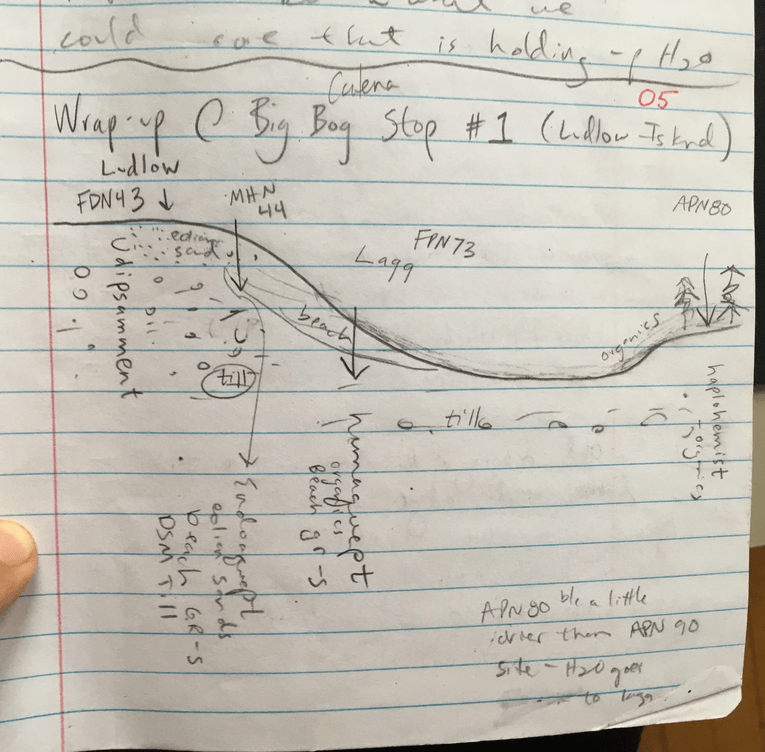

# Day 5: The Northern Peatlands

6/1/2019 

##Upper Red Lake @ Public Access Beach  

Core with gleyed sands (blue/grey)  
Wassent - submerged soil.  Get these on beaches or tidal marshes 

A -Tiny  
C  
Cg - Multiple Cg horizons  

* On Google Earth, can see series of sand bars in the lake (Adam demonstrates this by walking into the lake)  
* Get little dunes on the outer edges of the lake that were blown up off the lake bed 
* Connection to the UMN campus pit / small dune field on edge of Anoka Sand Plain 

##Big Bog SRA 

* Ludlow Island (?) driving on mineral soil island on road into Big Bog SRA 
* Notice that roads and infrastructure are preferentially built on mineral islands around here 
* We will see a catena:  psamment > endoaquept > humaquept > haplohemist
* We will see a transition of ecological types:  MHN 44 > FPN 73 > APN 80 >FDN 43  

**First site is MHN 44:  balsam, cedar, popular** 

Core 1 Endoaquept (MHN 44)  
A -Sandy loam (water-worked lake sediment)  
B? -Gravelly coarse sand (water-worked lake sediment)  
Cg - 2.5Y 6/3, Des Moines Lobe Till  

**A big lagg**

Next we move to a new site - a huge lagg.  Probably wetter here than on the bog itself.  The lagg is ~200m wide here (compare this to ~5m lagg at Marcell)  

Vegetation: Alder (Tag or Speckled), Alsnus incana subs. rugosa ???, horsetail, marsh marigold  

Second site ecological type is FPN73 - forested peatland.  This is the richer of 2 peatland types.  The other type is AP (acidic peatland), which is more nutrient-poor.  

Core 2 Humaquept  (FPN 73)  
0-30cm Fibric to hemic material  
30cm + Saturated mineral material  

Q. How is this humaquept different from the endoaquept we just saw?  

A. Here we see organics present, and a thicker gravelly sand layer.  We are down-drainage from the endoaqupet and see higher water here.  Historically this may have been an active beach - explains thick coarse gravelly sand layer. 

Core 3  (APN 80) 
We saw an abrupt transition while walking the path - start to see sphagnum, black spruce, tamarack, cranberry, cotton grass, bog laurel 

APN 80 defined by 25% canopy above 5m tall trees.  APN 90 would be more open with stunted trees

Q. Why do we see more tree canopy here? 

A. We have been walking up in elevation on bog - more acid here means that decomposition is slower, trees can get their shallow roots out of the saturated zone.  Think of this as a landscape scale version of the smaller Marcell peatland. This area is predominantly rainfed, water flows toward lagg, not toward bog.  Could see radiating pattern on satellite photos because of the shape of the bog dome
Core 4 (FDN 43) - this is back in the woods on a mineral island, we spent a while looking for a relatively undisturbed point on the mineral island.  Looking for the psamment in our catena. 

* We are on a high point - see bush honeysuckle.  
* Fine sands at top of core - likely dunes with some eolian influence
* Not much organic matter (worms likely culprit)
* Because we see redox features here, likely have till below what we were able to pull up with the auger that is holding up water in the profile 

Psamment  
A To 18cm  
E  
Bw  Multiple Bw horizons, redox, depletions at 55-60cm  

##Big Bog Boardwalk 

(observing transitions in vegetation as we walk the boardwalk, each transition has a # below) 

* 1 - Entry: black ash  
* 2 - Lagg FPN 73: alder, willow  
* 3 - FPN 71: richer forested transition): black spruce, tamarack, bog birch, mixed with alder.  Not a true bog because of density of alder and black spruce.  This would be considered a “rich black spruce swamp”   Water tracks - can see where water moves through the peatlands in infrared photos.  Find richer species in the water tracks.  Water in contact with underlying mineral material creates richer conditions, more diverse species  
* 4- less bog birch and alter than #3, thinner and smaller trees.  Transition to APN 81.  When we see the alder and bog birch disappear, we will know that we have transitioned to APN 80.   
* 5- Old drainage ditch on section line and edge effect - significant opening in the trees.  Disturbance from ditch actually gives you richer species: seeing sedge here now.   
* 6- APN 90 25% canopy cover above 5m tall 
* 7- APN 90B  water track (visible on aerial photo) toward the end of the boardwalk water is draining N/S.  Unlike the ditch, this is a natural opening. Many water tracks have richer species.  The “B” means this is a graminoid dominated area.  “A” would be shrub dominated 

Nic references patterned peatlands, “flark & string” ??  Herb Wright paper on patterned peatlands 

Why is this peat more thawed than back in the APN 80?  Because of the water movement. 
