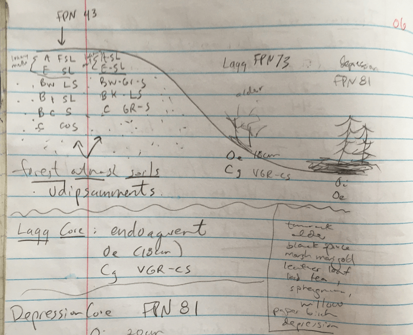

# The Forest-Prairie Transition

6/2/2019 

##Itasca -  UMN CBS properties  

* Acquired 2 plots separated by road at end of 2017
    + 20 acres 
    + 44 acres 
* Split class group into upland and lowland teams 
* These pieces of land are next to Iron Springs Bog, a bubbling iron-rich spring. (To the west and north) 

**Upland team (forest & pasture cores) FDN 43 and MHN ??**

This was a grazed field.  Has all been logged within the last 40 years 
Forest seems pretty disturbed - can’t really use trees for ecological ID.  Understory could be helpful though

Forest - FDN 43  
A -FSL  
E -SL  
Bw -LS  
Bt -SL  
B? -S  
C -COS  

Pasture MHN ??          
A -SL  
E -SL (small horizon)  
Bw -GRS  
Bt -LS  
C -GRS  

Parent material for these upland cores is outwash - but this isn’t an outwash plain! 
Nic thinks that there are strings of outwash incised by modern drainage - this is a dissected outwash plain 

**Lagg Team**

Endoaquent  
Oe - To 18cm  
Cg - VGR-CS  
Cg -Multiple Cg horizons  

**Depression team** 
Species: alder, birch, balsam, poplar, aspen, horsetail, willow, red osier dogwood, tamarack, marsh marigold, leather leaf, labrador tea  
FPN 81  

Haplohemist  

Oi -To 20cm  
Oe - 20+ cm  

SAMPLES FROM THE ITASCA PROPERTY  

**Send the diagram/drawing below and soils info to Jonathan (Itasca)** 

Itasca North Property = NP   
NP Upland Forest Udipsamment   
1 = E 11-21cm   
2 = C 140+ cm  
3 = Bw 21-44 cm  

NP Upland Grazed Udipsamment  
4 = Bw 25-62cm  
5 = C 100cm+  

NP Lagg  
6 = Cg 30+cm  

NP FPN 81 Haplohemist  
7 = Oe 60-160cm  

Itasca South Property (this is the larger one, 44 acres)   

Hapludalf - parent material Des Moines Lobe Till.  Shale & limestone present.  Some effervescence w/ HCl at 90cm, violent effervescence 120+ cm. This is a forest soil - Beltrami series 

A -FSL, to 10 cm  
E -L  
Bt -CL  
C -L  

##Langby Waterfowl Production Area:  Forest-Prairie Transition Zone 

2 upper cores (same horizons)  
Hapludolls  
A -Effervesces at surface  
C  

Lower core - either a typic argiudoll OR a mollic hapludalf  
A-SLto 20cm  
AE  
Bt-CL  
Bk-L  
C  

**3 cores - major trends** 

* no E, higher carbonate compared to Itasca 
* A horizons getting thicker and darker.  
* Seeing carbonates higher in the profile 
* Two upper soils are eroded versions of what was originally here - explains why topsoil is fizzing 
* Series = Langhei
* Lower core has post-settlment alluvium, ~10cm of slightly lighter color at top of A horizon.  This is a utradept (high pH udept)  ?? not sure Hava got this right…
* Why do we see carbonates right below Bt?  This is a common pattern in these soils, in calcareous tills, have to get carbonate out before clays will move. Flocculation! Refer to basic soils flocculation lab 
* Ca will flocculate clays - making it hard to elluviate them 
* Humans “reset” the soil here: in teh erroded phases we are seeing A horizons developing in parent material 

##Mentor Prairie

WPN 53 (Northern Wet Prairie) 

Plants: lousewort (pedicularis), golden alexander (Zicia area), red osier dogwood, puckoon, willow, blue-eyed star grass, small white lady slipper  

There are more trees here than we would have seen historically because of fire suppression 

A - Highly organic loam (feels very nice)   
B - Fine sandy loam  
? horizon - FSL & redox features  
? horizon - GR-SL  

* We are into Glacial Lake Agassiz Basin (flat, but not yet seeing lacustrine sediment) 
* Subsurface textures - loams & coarse fragments 
* Surface textures - fine sandy loams
* Landscape = water-worked till, maybe some eolian reworked 
* Fire return intervals here are less than10 years because there is no topography or surface water bodies to slow fire.  
* FDW34 is also a classification you find in this area, might not see it today.  This would be a drier site, possibly beach ridges 

Summit - Epiqauoll  
Ak1  Between 10YR 2/1 and neutral, FSL, 0-22cm, eff at surface  
Ak2   FS, 22-48cm  
Bkg   10YR 5/1, L, 48-63cm  
Bk   L, 63-88cm  
C   2.5YR 6/3, L, coarse fragments  

Toeslope - Aquic hapludoll  
A1   Highly organic L 0-22cm  
A   FSL 22-47cm  
Bw   FSL 47-62cm  
Ckg  L and coarse fragments, 10-12% carbonates  

(in reality this toeslope is only a couple inches down from the “summit” sample - we are in subtle topography here)  

[Illustration of redistribution of carbonates ] 

Discussion & illustration about redistribution of carbonates  
Carbonates redistribute on the order of years to decades, but only start to see morphological differences in the decades-century time scales   

[Illustration of Forest-Prairie Transition] 

##Ground Squirrel Colony 

FDW 34

* Drier soil here, but water isn’t too far down in the profile 
* This was historically a fire-dependent woodland (FDW).  Landform is a beach ridge formed by wave action from Lake Agassiz.  We are seeing beach sand! 
* See overthickened A horizon here despite the drier conditions -- thanks to bioturbation
* Textures are fine sandly loam (little eolian influence) over gravelly sand. 
* It’s possible to see these beach ridges on LIDAR, but can be harder to see them on landscape 
* From here to East Grand Forks, generally land is grading down with occasional bumps in elevation 
* Different lake levels deposited different sizes of sand/material 
* This is an entic hapludoll or oxyaquichapludoll 
* See the profile inverted in the mound - C horizon over Ab 

Don't forget to reference Chase Kasmerchak et al's paper here (forest prairie transition) 