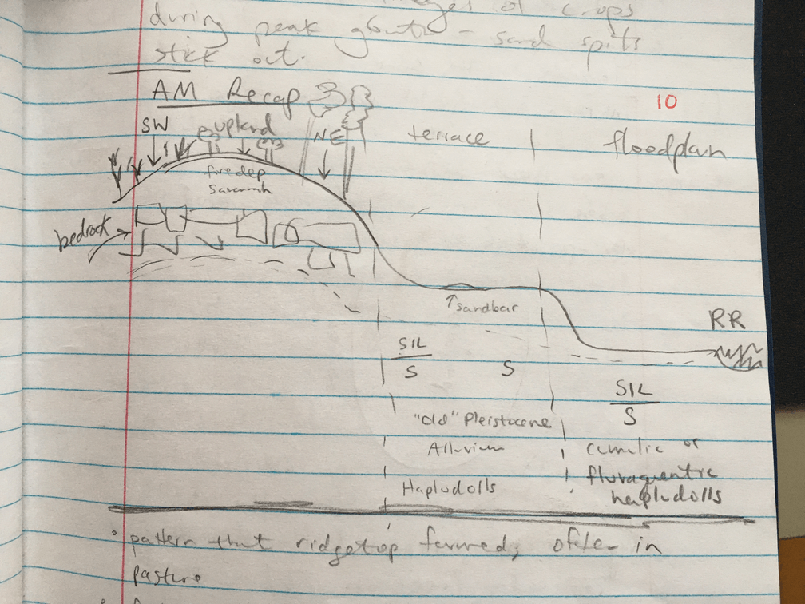

# Day 10: The Driftless I

6/6/19 

##Featherstone Farm

(Jack Hadine (sp?)) 

**Intro to Featherstone**

* Jack has been farming for a long time in many different places - he runs an organic fresh market vegetable farm, manages ~230 acres.  130-140 acres of annual veg each year. 
* 75% of this land is in the valley (best soils), and ¼ is on the ridge (basically farming clay subsoil but better drained) 
* Need to have the soil /microclimate/aspect line up in order to create a viable agricultural system 
* Production - 300 summer CSA shares, 500 winter CSA shares, 10 months out of year wholesale production 
* Jack likes the idea of feeding LOTS of people locally
* In Dec, Jack purchased 22 adjacent acres to his building at agricultural value
* FF moved to this site in 2008 

**Management Decisions and Changes** 

* Featherstone is a the beginning of their “high tunnel production era”  - allows for more consistent production, some control over conditions compared to outside. 
* In the next 3-6 years the plan is to have an area of 250’ x 250’ under plastic with gutters connecting the high tunnels. 
* High tunnels have much greater yields than growing outside - see increase of 12-15x yield for peppers and tomatoes in the high tunnel 
* From a production standpoint, Jack feels he has more in common with conventional vegetable producers than with organic dairy or meat farmers
* Jack and his crew manage many succession plantings of fresh market crops to meet wholesale demand - for example, he will have 8 plantings of broccoli across 2 acres in order to provide 2 consistent months of broccoli in Sep-Oct. Need to produce 500 cs/week for wholesale customers. He is competing with the Central Valley in CA where 90% of the broccoli in this country is grown
* Across the farm there are large variations in soil, drainage, wind that impact how the different crops are grown
* Difference between hoophouse and greenhouse: greenhouse is heated, controlled environment.  High tunnel/hoophouse is not heated, but it is protected. The larger the covered area under plastic, the greater the effectiveness because there is less edge effect - this is driving his goal to have a large area under plastic 

**Climate change and sustainability**

* One climate adoption irony - the volatile weather is driving the use of plastic mulch and high tunnels as a way to stay sustainable (as a business) 
* Jack tried “sustainability” in the form of solar panels about 9 years ago, and nearly went broke trying to pursue that route.  Now he thinks in terms of climate adaptability 
* Rainfall is another challenge; seeing more intense rain, more wet periods.  This causes disease issues for the plants.
* Jack is seeing lots of changes in climate in a very short time period 

**Challenges** 
* Climate change, weather variability (see above)
* Labor is big challenge for the farm - they are trying to use machines as much as possible.  
* Land tenure another big challenge - trying to increase production on his owned land to buffer volatility if he loses a lease on the other land.  Jack’s first land cost $400/acre.  Where we are now cost $9,000/acre. 

**Good soil is key for successful farming** 

* What makes this particular site special from a soil standpoint?  He feels he went from a D- vegetable site at his old place to A+ here.  The soil makes a HUGE difference! 
* We are in a unique area from a natural history and soil standpoint.  We are standing in a classic floodplain here - at one point river would have flooded up this far, renewing the soil.  We are in the “X” of ancient oxbow where soils were laid down for millenia by the river 
* Black silt loam, high organic matter soils grow delicious veggies!  That’s the magic -- and since the silt loam is laid down on sand, they still get decent drainage, ability to get in fields to work  just a few days after rain
* It’s very important to preserve the best agricultural land - not build over soil like this that is ideal for food production
* This land was originally zoned commercial in Rushford Village.  Was very difficult to purchase it at agricultural value.  Nic and Jack met to develop a scientific narrative for why this land has unique value for farming/vegetable production.  
* Jack grows a wide diversity of crops.  This is an important part of risk management; grow cool season and warm season crops in different areas, use microclimates on the farm strategically, buffer against risk
* Requires a significant skillset to manage all these different types of crops
* For cover crops, they use rye/vetch mix and oats/peas mix.  Tries to keep ground covered as much as possible. 
* They also use mycorrhizal amendments in the transplant water 
* This is an organic farm, but that doesn’t mean it’s a low-input farm; they do lots of micro-amending with Cu, Zn, S, Ca.  Jack has great horticultural students putting their knowledge to work on the farm 
* His fields are organized in 4 acre blocks, and 80% of the fields have soil tests every year
* Distinction between adding microamendments to the SOIL vs. crop managers doing plant nutrient management during the season depending on the needs of the crop.

**Featherstone Farm Soils**

* We will be looking at the Waukegan series here – this is the same series as our experimental field at UMN
* The general Waukegan concept is loess over outwash (not the case here). 
* Silt loam over very fine sandy loam over medium [sandy loam]  à this is exactly what we would expect to see in an oxbow
* We found carbonates in this soil – surprising because this is the wettest part of the state
* Generally, parent material for Waukegan is loess over outwash.
* Depth to outwash (sand) on true Waukegans is very consistent. 
* In contrast, on this landscape depth to sand is much more variable
* Here in Jack’s field, the parent materials is alluvium (For all cores we are looking at).  This fits morphologically into the Waukegan box, but it has a different parent material than the general Waukegan
* Nic mention Beth post-doc trying to develop crop productivity indices
* For alluvium – coarser textured sand in main channel.  Finer sand in backwaters (like an oxbow lake or backwater swamp
* We see fining upward here in these cores – this is consistent with alluvium deposition here.  It is very different from the abrupt transition between coarse sand and silt [that you can see in the campus experimental fields??]
* Compared to other Waukegans the class has seen, these have thicker A horizons, more organic matter. * Likely more plant available water  because of depth of silt
* We are looking at a drainage sequence left to right here [[Sharon took picture of grouping]]
* Surprisingly – carbonates present all over the place, including the sand! 
* 2 reasons we might see carbonates here:
    + Some calcareous material coming down from upland part of alluvium is rich in carbonates.  Could have contributed carbonate-rich loess
    + We are close to the water table here, this can draw carbonates up through evaporative action

* Classification for these soils: (typic) hapludolls
* These soils have A horizons that are approximately 2X as deep as most Waukegans.  2-3% more organic matter.  The sand is deeper here but still allows water to drain
* Carbonates buoy up pH to ~7 here
* These soils have been cut off from river sediment for 1000s of years (order of magnitude) Don’t see stacks of A horizons here, but might see something like that down closer to river
* We are relatively disconnected from the uplands, this landform not conducive to post-settlement alluvium deposition

##2 cores from neighbor’s field (near Featherstone Farm) 

We saw a typic hapludoll and an entic hapludoll here.  This is a terrace from Pleistocene era flooding  

Typic hapludoll:  

Silt loam  
Sandy loam  
Med sand  
Coarse sand  

Entic hapludoll:  textures are all medium sands  

* This is an old terrace from the Root River - parent material is old alluvium 
* No effervescence - totally disconnected from local hydrology 
* Plant growth is terrible on the sand splits - these are old sand bars that were in the river 
* Aspect matters a lot on these landscapes 
    + SW slopes get more solar radiation at hotter times of day.  Would have been prairie historically 
    + On west slopes would have seen savannah/ scattered trees
    + North slopes - mesic hardwood forests, basswood, maple 
* Sediment load and flow are balanced in a river. Rivers can be flowing and depositing or flowing and incising.  Amount of erosion and sediment being fed into the river, flow volume determines threshold of deposition
* If you look at aerial pictures of crops during peak growth - the sand spits stick out (because crop growth is so bad) 
* Jack tells story about 2 acres of carrots in the fields near this sandy field - there was a huge difference in flavor between the carrots grown on the black soil vs the sandy soil! Eventually he gave up on the sandy field - it was a headache to irrigate.  Workers called it the “Zone of Death”
* Jack is experimenting with introducing cattle in a new rotation on the highly erodible soils, taking them out of vegetable production for up to 3 years 
* Typically the ridges in this area are farmed at the top/summit with pasture along the edge (bird’s eye view picture.  

**Morning Recap at Featherstone**

* We started out by looking at floodplain soil - silt loams over sands.  
* The red cedars we saw on the SW slopes would not have been there pre-settlement

**Impact of Aspect on Soil Development (Featherstone Farm)**

* We will see that aspect completely changes the soil type, vegetation, moisture, and temperature regimes*

* Summit - parent material is loess.  Pretty uniform color and appearance (which is weird!) Thin A horizon here.  These ridges have been farmed since European settlement - this is a highly eroded version of the soil that was once here.  

* Silt loams on narrow ridgetops with drainage that goes directly to the river.  Erosion has a big impact on water quality here.  

Marginal alfisol (hapludalf) or entisol (distrudept).  
Ap - silt loam  
Bt- silty clay loam  
C - silt loam  
 
* SW Slope - Goat prairie! Now it is filled with red cedar.  Hot and dry environment, droughty.  In some spots not even red cedars will grow.  The cedar stands on the steep slopes in the driftless can be a compass pointing SW

Native vegetation here would have been upland dry prairie (almost xeric)  

Lithic Hapludoll - parent material is loess.  Special rule when mollic horizon sits directly over bedrock - only need 10cm to qualify as mollic
A1  
A2  
R  

* Upland/Ridge 
Eroded savannah soil, Typic Hapludalf, parent material is loess

Ap  
Bt  
C  

* NE Slope 
Forming partly from loess over residuum.   
It’s 8-10 degrees coler on N slope, especially under tree canopy  

Lithic Hapludalf  
Native/historic vegetation here would have been mesis oak basswood forest.   
A- 15 cm  
E - 40cm  
2Bt  

